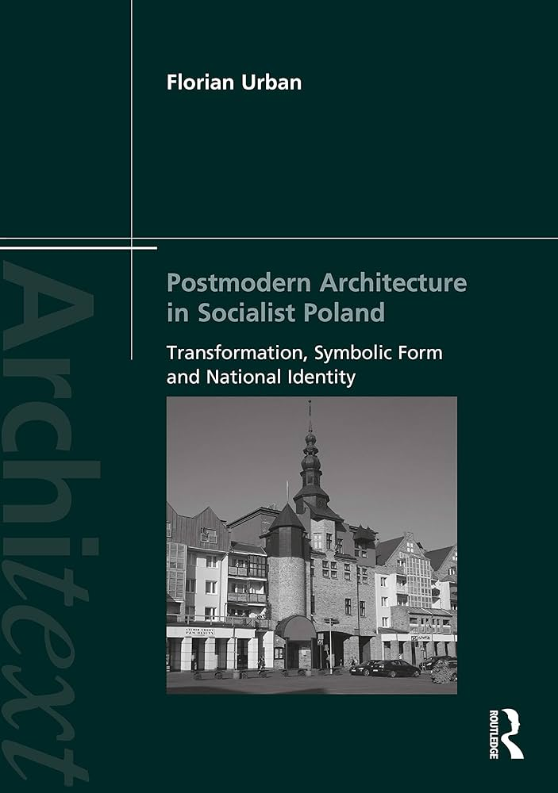
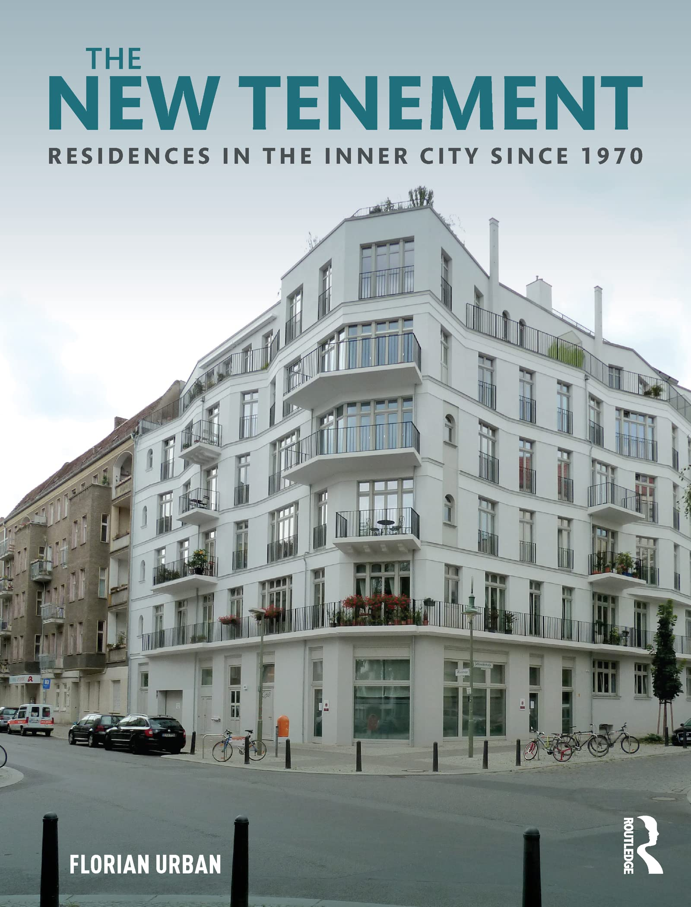
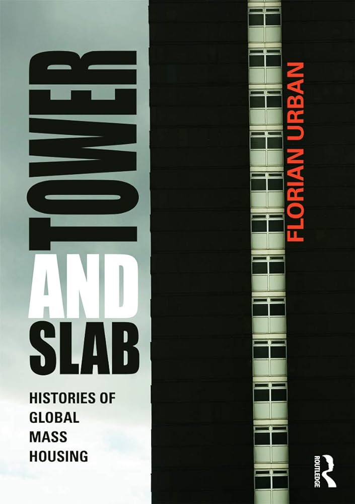
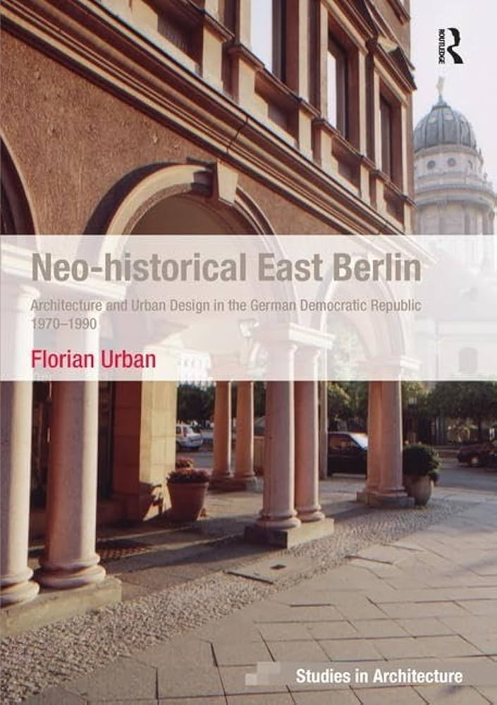
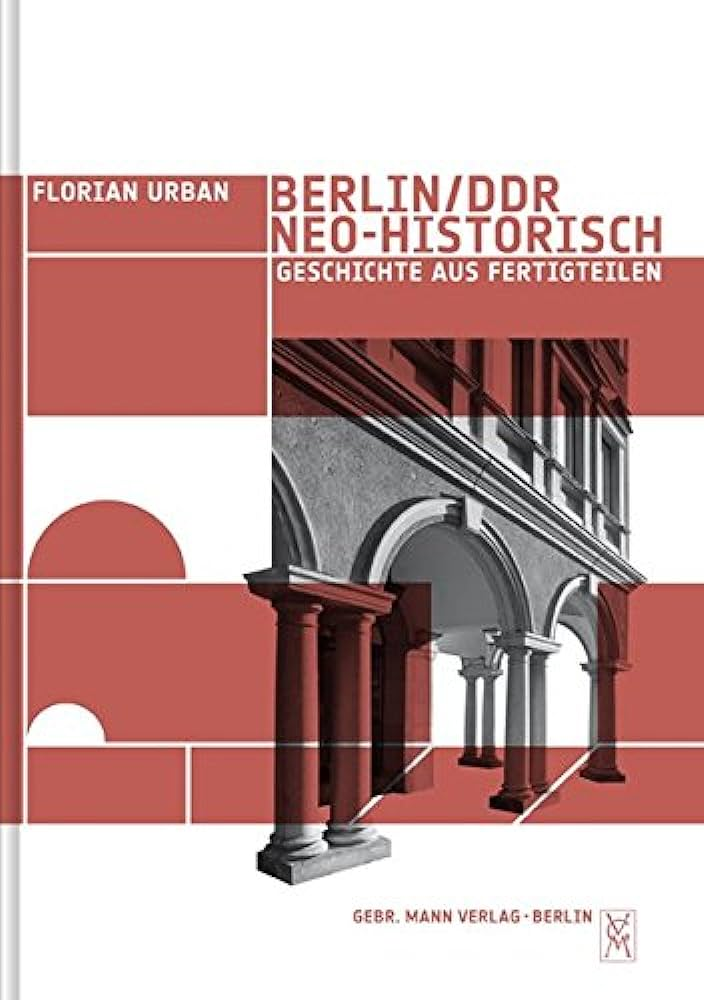

# Books

Forthcoming:

Architecture and Fuel - 12 Buildings from Antiquity to the Oil Age (Abingdon: Routledge, 2025), co-authored with Barnabas Calder

Postmodern Architecture in Socialist Poland - Transformation, Symbolic Form and National Identity (Abingdon: Routledge, 2021) 

The New Tenement – Residences in the Inner City since 1970 (Abingdon, Routledge, 2018) 

Tower and Slab – a Global History of Mass Housing (Abingdon: Routledge, 2012) – awarded the annual prize for the “best book on planning history written in English and based on original research” by the International Planning History Society (IPHS), Russian translation Vashnya i korobka: kratkaya istoriya massovogo zhilya (Moscow: Strelka Press, 2019)

Neo-historical East Berlin – Architecture and Urban Design in the German Democratic Republic 1970-1990 (Farnham: Ashgate, 2009)

Berlin/DDR, neo-historisch – Geschichte aus Fertigteilen [Neo-historical East Berlin – History from Prefabricated Parts] (Berlin: Gebrüder Mann Verlag, 2007)

# Peer-Reviewed Articles

“Does Postmodern Mean Capitalist? On Postmodernism and the Planned Economy in Poland and the German Democratic Republic” Architektura+Urbanizmus (Bratislava) 57 (2023) n. 3-4, <https://doi.org/10.31577/archandurb.2023.57.3-4.1>

"Beyond Formal and Informal: Mid-twentieth-century Residential Architecture in Barcelona's El Carmel Neighbourhood" Urban History n. 1 (2024) - co-authored with Kathrin Golda-Pongratz <https://doi:10.1017/S0963926823000627>

„Bottom-Up Postmodernism – Unauthorised Church Architecture in Socialist Poland” Journal of the Society of Architectural Historians 97 n. 4 (December 2020), 459-77, <https://doi.org/10.1525/jsah.2020.79.4.459>

„Postmodern Reconciliation – Reinventing the Old Town of Elbląg” Architectural Histories, October 2020, <https://journal.eahn.org/article/10.5334/ah.405/>

„Postmodernism and Socialist Mass Housing in Poland” Planning Perspectives 35 n. 1 (February 2020), 27-60 <https://doi.org/10.1080/02665433.2019.1672208>

„Postmodern Architecture Under Socialism – The Ascension Church in Warsaw-Ursynów”  Journal of Architecture 25 n. 3 (2020), 317-346, <https://doi.org/10.1080/13602365.2020.1758747>

“Copenhagen’s Return to the Inner City 1990-2010” Journal of Urban History 45 n. 3 (2019), 1-23, <https://doi.org/10.1177/0096144218824303>

„Vienna’s Resistance to the Neoliberal Turn - Social Policy through Residential Architecture from 1970 to the Present” Footprint 24 n. 1 (spring 2019), 83-104
 <https://doi.org/10.7480/footprint.13.1.2011>

„Modernising Glasgow–tower blocks, motorways and new towns 1940-2010” Journal of Architecture 23 n. 2 (2018), 265-309 <https://doi.org/10.1080/13602365.2018.1446182>

„Berlin’s Construction Groups and the Politics of Bottom-Up Architecture” Urban History 45 n. 2 (2018), 1-32 <https://doi.org/10.1017/S0963926817000694>

„Balmoral Castle – European Romanticism and Nation Building in the Scottish Highlands” [co-authored with Aonghus MacKechnie], Architectural History September 2015
<https://doi.org/10.1017/S0066622X00002628>

„La Perla – 100 years of Informal Architecture in San Juan, Puerto Rico“ Planning Perspectives 30 n. 4 (April 2015), 495-536, <https://doi.org/10.1080/02665433.2014.1003247>

 „The Hut on the Garden Plot – Informal Architecture in twentieth-century Berlin“, Journal of the Society of Architectural Historians 72 n. 2 (June 2013), 221-249 <https://doi.org/10.1525/jsah.2013.72.2.221>

„Glasgow’s Royal Concert Hall and the Invention of the Post-modern City,” Journal of Architecture 18 n. 2 (2013), 829-871, <https://doi.org/10.1080/13602365.2018.1495911>

„New Tenements and the Image of the Past – the Crown Street Development in Glasgow’s New Gorbals” Architectural Research Quarterly 17 n. 2 (June 2013), 37-48, <https://doi.org/10.1017/S1359135513000341>

„Japanese Occidentalism and the Emergence of Postmodern Architecture,“ Journal of Architectural Education 65 (March 2012), 89-102. <https://doi.org/10.1111/j.1531-314X.2011.01195.x>

“Mumbai’s Suburban Mass Housing,” Urban History 39 n. 1 (February 2012), 128-148 <https://doi.org/10.1017/S0963926811000812>

„Built Historiography in Glasgow’s New Gorbals”, Journal of Art Historiography 5 (December 2011), <https://doaj.org/article/d6135703e24f485d929bee2171d17631>

„Friedrichstraße, 1987: Neo-Historical Urban Design in the German Democratic Republic”, Planning Perspectives 23 n. 1 (2008): 1-28. <https://doi.org/10.1080/02665430701737950>

“Prefab Russia,” Docomomo Journal 39 (September 2008), 18-22.

„Designing the Past in East Berlin Before and After the German Reunification”, Progress in Planning 68 n. 1 (January 2008), 1-55, <https://doi.org/10.1016/j.progress.2007.07.001>

„From Obsolescence to Eternal Preservation”, Future Anterior 3 n. 1 (Mai 2006): 24-35.  [herausgegeben vom Fachbereich Architecture, Planning and Preservation der Columbia University, New York] 

„Rudolf Schwarz and the Speech of the Land – Grammar as a Political Device in Postwar Germany” Journal of Architecture 9 n. 3 (Fall 2004): 251-266 <https://doi.org/10.1080/13602360412331296080>

„Recovering Essence through Demolition – 'Organic’ Urban Design in Postwar West Berlin” Journal of the Society of Architectural Historians 63 n. 2 (2004): 354-369 <https://doi.org/10.2307/4127975>

„Picture Postcards of Urbanity – Reflections on Berlin’s Inner City and the 1999 Master Plan” Journal of Architectural Education 57 n. 1 (2003): 68-73 <https://doi.org/10.1162/104648803322336601>

„The Spirit of the City – Transcendence and Urban Design in Postwar Berlin”, Thresholds 25 (Fall 2002): 84-89 <https://www.mitpressjournals.org/doi/pdf/10.1162/thld_a_00383>

„Image – ein gestalterisches Element der Stadtentwicklung” Archiv für Kommunalwissenschaften 38 n. 1 (Februar 1999): 109-118 [herausgegeben vom Deutschen Institut für Urbanistik (DIFU)] <https://repository.difu.de/jspui/handle/difu/58803>

# Other scholarly publications (Selection)

"Postmoderne und Ökobewegung - eine Einführung" [postmodernism and the ecological movement - an introduction] in Kirsten Angermann and Hans-Rudolf Meier, eds., Denkmal Postmoderne (Basel: Birkhäuser, 2024)

“Notable Architecture” in Dorothee Brantz and Gábor Sonkoly, Cambridge Urban History of Europe (Cambridge: Cambridge University Press, 2024), vol. 3 1850-present

“Beyond Formal and Informal - the Century-old 'Slum' La Perla in Puerto Rico” in Alan Mayne, ed., The Oxford Handbook of Modern History of Slums (Oxford: Oxford University Press, 2023)

"The Old Town of Elblag - a Postmodern Historic Monument" in Oleksandr Anismov, ed., After Socialist Modernism - Architecture, Urban Design and Planning of the 1980s/ Після соціалістичного модернізму -  архітектура, міський дизайн і планування 1980-х [in English and Ukrainian], Misto: Istorija, Kultura, Suspilstwo - E-zhurnal urbanistichnikh studiy no. 1 (13) - 2022 (Kyiv and online), pp. 334-351 

"The End of the Planned City? Urban Planning after 1989" in Max Welch Guerra, Abdellah Abarkan, María Castrillo Romón and Martin Pekár, eds., European Planning History in the 20th Century - A Continent of Urban Planning (Abingdon: Routledge, 2023), 256-67.

"Tower Blocks, Infills, Eco Estates — The Discourse on Social Housing in West Germany" in Simon Güntner, Juma Hauser, Judith Lehner and Christoph Reinprecht, eds., The Social Dimension of Social Housing (Leipzig: Spector Books, 2022), 248-63

„A Socialist Temple to Consumerism: The Passagen Friedrichstadt and the Unrealized Plans for Friedrichstrasse/ Ein sozialistischer Konsumtempel – die „Passagen Friedrichstadt“ und die nicht realisierten Pläne für die Friedrichstraße“ in Ursual Müller, ed., Anything goes? Berliner Architekturen der 1980er Jahre (Berlin: Kerber, 2019) [catalogue for an exhibition at the Berlinische Galerie]

“Large Housing Estates of Berlin, Germany” in Daniel Baldwin Hess, Tiit Tammaru, Maarten Van Ham, eds., Housing Estates in Europe: Poverty, Ethnic Segregation and Policy Challenges (Berlin: Springer, 2018), 99-120.

“Improvisation: Allotment Sheds (Berlin)” in Marcel Vellinga, ed., Encyclopedia of Vernacular Architecture (London: Bloomsbury, 2018)

“Germany, Country of Tenants” Built Environment 41 n. 2 (2015), 183-195.

“The Märkisches Viertel in West Berlin” in Mark Swenarton, Tom Avermaete, and Dirk van den Heuvel, eds., Architecture and the Welfare State (Abingdon: Taylor and Francis, 2015)
„The Friedrichstadt Palace in East Berlin“ in Alistair Fair, ed., Setting the Scene: Perspectives on Twentieth-Century Theatre Architecture (Farnham: Ashgate, 2015), 219-36

 “Public Housing in Europe” in Nicholas Bloom, Fritz Umbach, Lawrence Vale, eds., Public Housing Myths: Perception, Reality, and Social Policy (Ithaca, NY: Cornell University Press, 2015), 154-174.

“East Berlin” in Emily Makas, ed., Capital Cities in the Shadow of the Cold War (New York: Alexandrine Press, 2013)

“Postmoderne als Konsens: Neo-historischer Wiederaufbau im Ost-Berliner Nikolaiviertel 1977 – 1989” in Georg Wagner-Kyora, ed., Wiederaufbau europäischer Städte. Rekonstruktionen, die Moderne und die lokale Identitätspolitik seit 1945/ Rebuilding European Cities. Reconstructions, Modernity and the Local Politics of Identitiy Construction since 1945 (Stuttgart: Franz Steiner, 2013)

“Mass Housing in Germany – Controversial Success and Ambivalent Heritage” in Jorge Lizardi and Martin Schwegmann, eds., Espacios Ambivalentes: historias y olvidos en la arquitectura social moderna (San Juan, Puerto Rico: Ediciones Callejón, 2012), 52-75.

“Erker im Plattenbau – Die DDR entdeckt die historische Stadt” in Frank Betker, Carsten Benke, Christoph Bernhardt, eds., Paradigmenwechsel und Kontinuitätslinien im DDR-Städtebau (Erkner/Berlin: IRS, 2010)

“Talking Japan,” in Peter Herrle and Erik Wegerhoff, ed., Architecture and Identity (Münster: LIT Verlag, 2008), 91-102

# Other publications (selection)

"It is time no longer to praise the Seagram Building, but to bury it" [comparison of the energy profile of Mies van der Rohe’s iconic Seagram Building with Waugh Thistleton’s 6 Orsman Road (co-authored with Barnabas Calder), Architects Journal 249 n. 8 (10 November 2022)

"Black to the Future [energy use comparison between a C19 Lewis blackhouse and a typical C21 UK volume housebuilder home] " (co-authored with Barnabas Calder), Architects Journal 249 n. 8 (25 August 2022), 24-31  

"Back to the Future [energy use comparison between the Baths of Caracalla, Rome (212-217 AD) and the Marks and Spencer Marble Arch Store, London (2018)]" (co-authored with Barnabas Calder), Architects Journal 249 n. 3 (24 March 2022), 54-61.  

“The Oude Westen, a model for Europe/ Het Oude Westen, een model voor Europa” [in English and Dutch], in Pieter Kuster and Emine Yilmazgil, eds., West Side Stories – Ruimte voor de stadsvernieuwing (Rotterdam: Office for Metropolitan Information, 2019) [exhibition catalogue]

“The end of the suburban dream” Building Design 26 January 2018
 “Die neue historische Stadt” – Online dossier Stadt und Gesellschaft, published by the German Bundeszentrale für politische Bildung (Federal Agency for Civic Education), 2017.

“La ville divisée 1945-1989” in David Sanson, ed., Berlin – Histoire, Promenades, Anthologie et Dictionnaire (Paris: Editions Robert Laffont, 2013)

“Mega-Tokyo,” in Megastructure Reloaded, ed. Markus Richter and Sabrina van der Ley (Stuttgart: Hatje-Crantz, 2008) [exhibition catalog], 87-96.

“Der Slum als Standortvorteil: Wohnsilos gegen Wellblechhütten – wie man in Mumbai versucht, die Wohnungsmisere zu bekämpfen,“ Süddeutsche Zeitung 16 November 2008

“Sehnsucht nach der Platte – in der 16-Millionen-Metropole Shanghai erprobt man neue Konzepte für den Stadtumbau”, Süddeutsche Zeitung 16 December 2007

“Das Recht auf vier Wände – Peter Marcuse über die Zukunft des städtischen Wohnens,” Süddeutsche Zeitung 11 July 2006

“Stadt in den Köpfen – Metropole und Megacity, die Konferenz Urban Age in Berlin,” Süddeutsche Zeitung 14 November 2006

“Die globale europäische Stadt“ [German, English, Spanish, Italian, June 2008], Goethe-Institute Online <http://www.goethe.de/kue/arc/dos/dos/sls/de3481742.htm>

